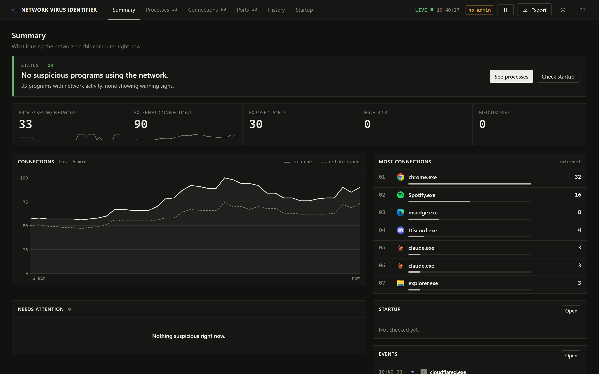
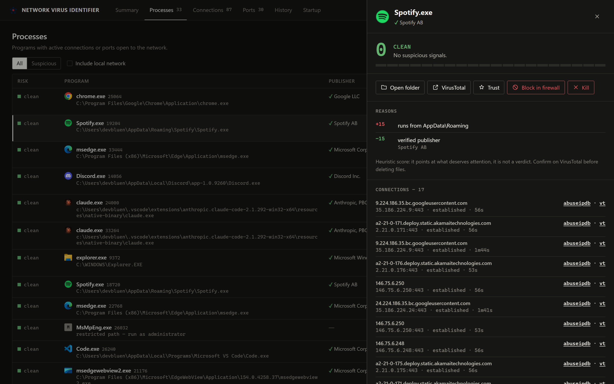

<p align="center">
  
</p>

<h1 align="center">NETWORK VIRUS IDENTIFIER</h1>

This application helps you find active remote malware on your computer (RATs, backdoors, miners, stealers) by watching **which processes talk over the network** and giving each one a **risk score** that explains its reasons. It only identifies: removal is up to you.

> [Português](README.pt-BR.md)

# 📷 Preview



<details>
<summary><b>Process details</b></summary>



</details>

# ✨ What it does

- **Real-time dashboard**: opens in its own window (Edge/Chrome app mode) and refreshes every 2.5s.
- **Per-process risk score** (Clean / Low / Medium / High), with every point explained:
  - unsigned executable, or invalid/tampered signature
  - running from suspicious folders (Temp, AppData\Roaming, Downloads, Public, Recycle Bin, Startup…)
  - Windows process name outside the Windows folder (e.g. a fake `svchost.exe`)
  - Windows tools abused by malware (`powershell`, `mshta`, `rundll32`, `certutil`…) reaching the internet
  - suspicious command line (`-enc`, `-w hidden`, `DownloadString`, `IEX`…)
  - connecting to or listening on common RAT/C2 ports (njRAT, Quasar, AsyncRAT, Remcos, Metasploit, Tor…)
  - **beaconing**: repeatedly reconnecting to the same IP (typical C2 behavior)
  - recently created executable, started by Office (macro), file deleted from disk…
- **Tabs**: Processes, Connections, Open ports, History (connected/disconnected/new process/alerts) and **Startup**.
- **Startup scan**: Run keys, Startup folder, scheduled tasks, third-party services, Winlogon hijack and IFEO, which is where malware registers itself to survive a reboot.
- **Actions**: open the file location, look up the SHA-256 on VirusTotal, look up the IP on AbuseIPDB/VirusTotal, kill the process, **block it in Windows Firewall** and mark it as trusted.
- **Export report** as JSON, to ask for help or keep evidence.
- Portuguese and English UI.

> The score is heuristic: it points at what deserves attention, it is not a verdict. Confirm on VirusTotal before deleting any file.

# 🐬 Running from source

1. Install [Node.js 20+](https://nodejs.org)
2. In the project folder: `npm i`
3. Start with `npm start` (preferably from an **administrator** terminal, to see every path and use the firewall actions)

Options: `--no-browser` (doesn't open the window, only prints the address) and `--keep-alive` (keeps running after the window is closed).

---
# 💾 Portable

<details open>
<summary><b>How to use?</b></summary>

1. Go to the [**Releases**](https://github.com/devbluen/Network-Virus-Identifier/releases) tab of this repository.
2. Download the **`NetworkVirusIdentifier.exe`** file.
3. Save it to any folder (or to a USB drive, since it's portable).
4. Double-click it and accept the administrator prompt (UAC).

The dashboard opens automatically. Closing the dashboard window also closes the program.

</details>

<details>
<summary><b>Requirements</b></summary>

- Windows 10 or later (64-bit)
- **Administrator** permission
- Microsoft Edge or Google Chrome (optional: without them the dashboard opens in the default browser)

</details>

## <b>Antivirus warning</b>

> Since this is an executable that calls PowerShell and `netstat`, Windows Defender and other antivirus software may flag it as a false positive. The source code is open and available in this repository, so you can review it or build your own executable (see below).

<details>
<summary><b>How to build the executable (for developers)</b></summary>

The project uses **Node SEA** (Single Executable Applications) to package the code.

```bash
git clone https://github.com/devbluen/Network-Virus-Identifier
cd Network-Virus-Identifier
npm i
npm run build
```

The result is saved at `build/NetworkVirusIdentifier.exe`.

### Project structure

```
Network-Virus-Identifier/
├── assets/              # icon and logo
├── scripts/build.js     # bundle (esbuild) + executable (Node SEA)
├── src/
│   ├── main.js          # entry point: local server + opens the window
│   ├── server.js        # HTTP/SSE on 127.0.0.1 with a per-session token
│   ├── monitor.js       # collection loop, history, beaconing
│   ├── collector.js     # processes (CIM) and connections (netstat)
│   ├── analyzer.js      # heuristics and risk scoring
│   ├── enrich.js        # digital signature, SHA-256, reverse DNS (cached)
│   ├── persistence.js   # startup scan
│   ├── firewall.js      # block/unblock in Windows Firewall
│   ├── powershell.js    # persistent PowerShell session (fast)
│   ├── config.js        # trusted list (%APPDATA%\NetworkVirusIdentifier)
│   └── ui/index.html    # dashboard
└── package.json
```

</details>

---
# Credits:
- **devbluen** (Created the script)
- [**Shazanxz**](https://github.com/Shazanxz/) (Portable Executable build)
