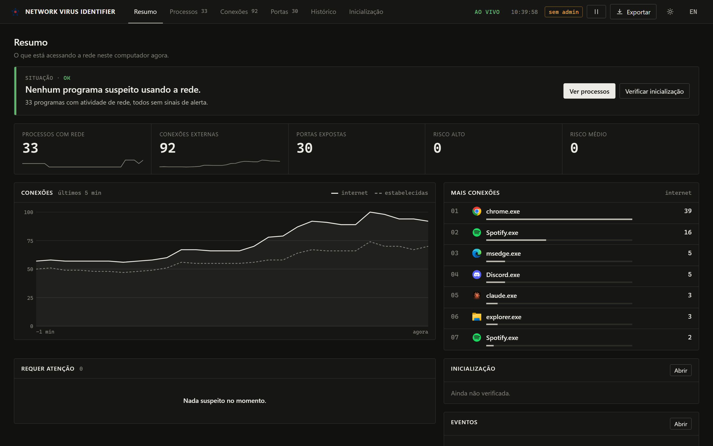
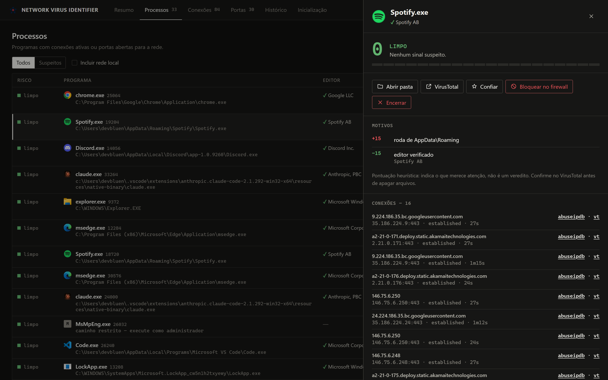

<p align="center">
  
</p>

<h1 align="center">NETWORK VIRUS IDENTIFIER</h1>

O objetivo desta aplicação é encontrar vírus remotos ativos no seu computador (RATs, backdoors, mineradores, stealers) observando **quais processos estão se comunicando pela rede** e dando a cada um uma **pontuação de risco** com o motivo explicado. Ela é apenas um identificador: a remoção é feita por você.

> [English](README.md)

# 📷 Preview



<details>
<summary><b>Detalhes de um processo</b></summary>



</details>

# ✨ O que ele faz

- **Painel em tempo real**: abre numa janela própria (Edge/Chrome em modo app) e atualiza a cada 2,5s.
- **Pontuação de risco por processo** (Limpo / Baixo / Médio / Alto), explicando cada ponto:
  - executável sem assinatura digital, ou com assinatura inválida/adulterada
  - rodando de pastas suspeitas (Temp, AppData\Roaming, Downloads, Público, Lixeira, Inicializar…)
  - nome de processo do Windows fora da pasta do Windows (ex.: `svchost.exe` falso)
  - ferramentas do Windows usadas por malware (`powershell`, `mshta`, `rundll32`, `certutil`…) acessando a internet
  - linha de comando suspeita (`-enc`, `-w hidden`, `DownloadString`, `IEX`…)
  - conexão ou escuta em portas comuns de RAT/C2 (njRAT, Quasar, AsyncRAT, Remcos, Metasploit, Tor…)
  - **beaconing**: reconexão repetida ao mesmo IP (comportamento típico de C2)
  - executável criado recentemente, aberto pelo Office (macro), arquivo apagado do disco…
- **Abas**: Processos, Conexões, Portas abertas, Histórico (conectou/desconectou/novo processo/alertas) e **Inicialização**.
- **Varredura de inicialização**: chaves Run, pasta Inicializar, tarefas agendadas, serviços de terceiros, sequestro de Winlogon e IFEO, que é onde o vírus se registra para voltar depois de reiniciar.
- **Ações**: abrir a pasta do arquivo, consultar o SHA-256 no VirusTotal, consultar o IP no AbuseIPDB/VirusTotal, encerrar o processo, **bloquear no Firewall do Windows** e marcar como confiável.
- **Exportar relatório** em JSON, para pedir ajuda ou guardar evidências.
- Interface em português e inglês.

> A pontuação é heurística: ela aponta o que merece atenção, não é um veredito. Confirme no VirusTotal antes de apagar qualquer arquivo.

# 🐬 Rodando pelo código

1. Instale o [Node.js 20+](https://nodejs.org)
2. Na pasta do projeto: `npm i`
3. Inicie com `npm start` (de preferência num terminal **como administrador**, para ver todos os caminhos e usar as ações de firewall)

Opções: `--no-browser` (não abre a janela, só imprime o endereço) e `--keep-alive` (não encerra quando a janela é fechada).

---
# 💾 Portátil

<details open>
<summary><b>Como usar?</b></summary>

1. Acesse a aba [**Releases**](https://github.com/devbluen/Network-Virus-Identifier/releases) deste repositório.
2. Baixe o arquivo **`NetworkVirusIdentifier.exe`**.
3. Salve em qualquer pasta (ou num pendrive, já que é portátil).
4. Dê duplo clique e aceite a solicitação de administrador (UAC).

O painel abre automaticamente. Ao fechar a janela do painel, o programa encerra sozinho.

</details>

<details>
<summary><b>Requisitos</b></summary>

- Windows 10 ou superior (64 bits)
- Permissão de **Administrador**
- Microsoft Edge ou Google Chrome (opcional: sem eles, o painel abre no navegador padrão)

</details>

## <b>Aviso sobre antivírus</b>

> Como é um executável que chama o PowerShell e o `netstat`, o Windows Defender e outros antivírus podem acusar falso positivo. O código é aberto e está neste repositório, então você pode revisá-lo ou gerar o seu próprio executável (veja abaixo).

<details>
<summary><b>Como gerar o executável (para desenvolvedores)</b></summary>

O projeto usa o **Node SEA** (Single Executable Applications) para empacotar o código.

```bash
git clone https://github.com/devbluen/Network-Virus-Identifier
cd Network-Virus-Identifier
npm i
npm run build
```

O resultado fica em `build/NetworkVirusIdentifier.exe`.

### Estrutura do projeto

```
Network-Virus-Identifier/
├── assets/              # ícone e logo
├── scripts/build.js     # bundle (esbuild) + executável (Node SEA)
├── src/
│   ├── main.js          # ponto de entrada: servidor local + abre a janela
│   ├── server.js        # HTTP/SSE em 127.0.0.1 com token por sessão
│   ├── monitor.js       # ciclo de coleta, histórico, beaconing
│   ├── collector.js     # processos (CIM) e conexões (netstat)
│   ├── analyzer.js      # heurísticas e pontuação de risco
│   ├── enrich.js        # assinatura digital, SHA-256, DNS reverso (com cache)
│   ├── persistence.js   # varredura de inicialização
│   ├── firewall.js      # bloquear/desbloquear no Firewall do Windows
│   ├── powershell.js    # sessão PowerShell persistente (rápida)
│   ├── config.js        # lista de confiáveis (%APPDATA%\NetworkVirusIdentifier)
│   └── ui/index.html    # painel
└── package.json
```

</details>

---
# Créditos
- **devbluen** (Criou o script)
- [**Shazanxz**](https://github.com/Shazanxz/) (Build do executável portátil)
