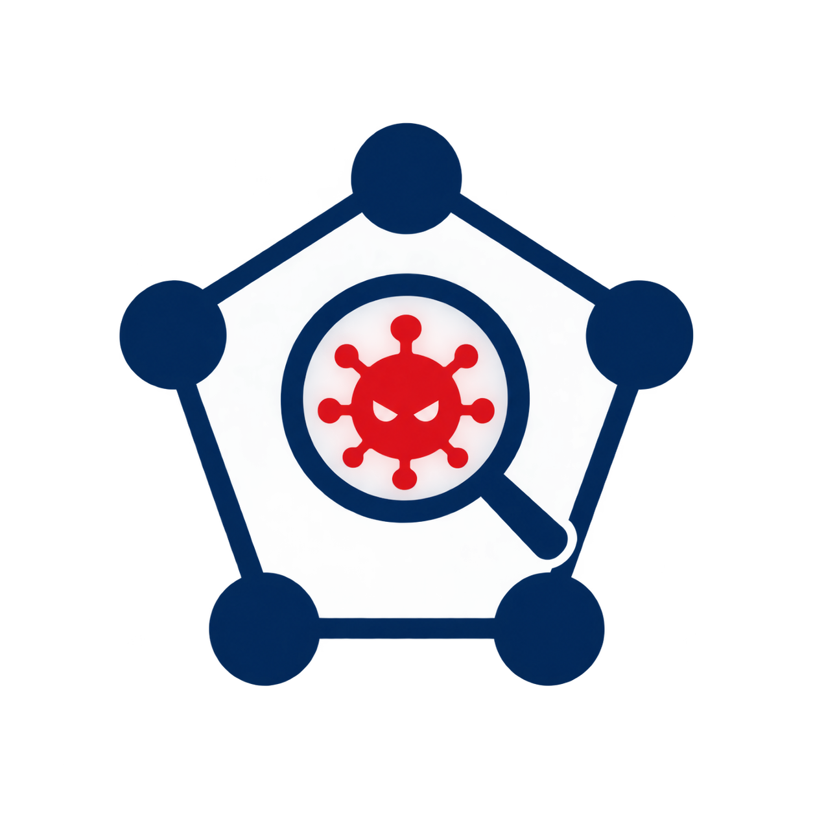

<p align="center">
  
</p>

<h1 align="center"> NETWORK IDENTIFY VIRUS</h1>
O principal objetivo desta aplicação é descobrir vírus remotos ativos na sua rede usando PowerShell. Lembre-se de que ela é apenas um identificador, a remoção terá que ser feita por você.

> [English](README.md) 

# 🐬 Como instalar?
1. Instale o node-js
2. Abra o terminal na pasta do projeto e execute `npm i` para instalar todas as dependências.
3. No mesmo terminal, execute `node .` para iniciar a aplicação e identificar qualquer processo suspeito.

# 📷 Terminal


---
# 💾 Portátil

<details open>
<summary><b>Como instalar?</b></summary>

1. Acesse a aba [**Releases**](https://github.com/devbluen/Network-Virus-Identifier/releases) deste repositório.
2. Baixe o arquivo **`NetworkVirusIdentifier.exe`**.
3. Salve em qualquer pasta (ou em um pendrive, já que é portátil).
4. Dê duplo clique para abrir e aceite a solicitação de administrador (UAC).

Pronto, o monitor já começa a exibir as conexões.

> Para fechar, basta fechar a janela ou pressionar `Ctrl + C`.

</details>

<details>
<summary><b>Requisitos</b></summary>

- Windows 10 ou superior (64 bits)
- Permissão de **administrador**

> O programa usa `netstat` e PowerShell, que já vêm no Windows. A versão para Linux está nos planos para uma próxima atualização.

</details>

## <b>Aviso sobre antivírus</b>

> Por ser um executável que chama PowerShell e `netstat`, o Windows Defender e outros antivírus podem marcá-lo como falso positivo. O código-fonte é aberto e está neste repositório, então você pode revisá-lo ou gerar o seu próprio executável (veja a seção abaixo).

<details>
<summary><b>Como gerar o executável (para desenvolvedores)</b></summary>

O projeto usa o **Node SEA** (Single Executable Applications) para empacotar o código.

### Pré-requisitos

- [Node.js 20 ou superior](https://nodejs.org)

### Passo a passo

```bash
# 1. Clone o repositório
git clone https://github.com/devbluen/Network-Virus-Identifier
cd Network-Virus-Identifier

# 2. Instale as dependências
npm i

# 3. Gere o executável
node build.js
```

O resultado fica em `build/NetworkVirusIdentifier.exe`.

### Estrutura do projeto

```
Network-Virus-Identifier/
├── assets/
│   └── logo.ico        # ícone do executável
├── build/              # executável final (gerado)
├── dist/               # arquivos intermediários (gerados)
├── index.js            # código do monitor
├── build.js            # script que gera o executável
├── sea-config.json     # configuração do Node SEA
└── package.json
```

</details>

## Créditos:
- **devbluen** (Criou o script)
- [**Shazanxz**](https://github.com/Shazanxz/) (Build do executável portátil)